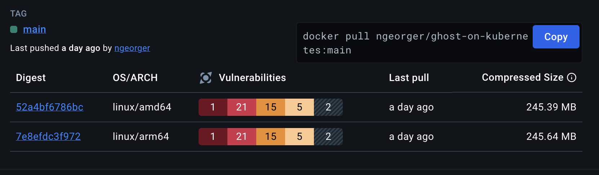

# Ghost en Kubernetes por SREDevOps.Org

<center><a href="https://sredevops.org" target="_blank" rel="noopener"></a></center>

## Comunidad para SRE, DevOps, Cloud Native, GNU/Linux, y más. 🌎 

[](https://github.com/sredevopsorg/ghost-on-kubernetes/actions/workflows/multi-build.yaml) | [](https://github.com/sredevopsorg/ghost-on-kubernetes/pkgs/container/ghost-on-kubernetes) | [](https://securityscorecards.dev/viewer/?uri=github.com/sredevopsorg/ghost-on-kubernetes) | [](https://github.com/sredevopsorg/ghost-on-kubernetes/fork) | [](https://github.com/sredevopsorg/ghost-on-kubernetes/stargazers) | [](https://www.bestpractices.dev/projects/8888)

## Introducción

Este repositorio implementa Ghost CMS v5.xx.x desde [@TryGhost (upstream)](https://github.com/TryGhost/Ghost) en Kubernetes, con nuestra imagen personalizada, la cual tiene mejoras significativas para ser usada en Kubernetes [(Dockerfile)](https://github.com/sredevopsorg/ghost-on-kubernetes/blob/main/Dockerfile). Lee este README completo para más información.

## Historial de estrellas

<picture>
  <source media="(prefers-color-scheme: dark)" srcset="https://api.star-history.com/svg?repos=sredevopsorg/ghost-on-kubernetes&type=Date&theme=dark" />
  <source media="(prefers-color-scheme: light)" srcset="https://api.star-history.com/svg?repos=sredevopsorg/ghost-on-kubernetes&type=Date" />
  
</picture>

## Cambios recientes

Hemos hecho algunas actualizaciones significativas para mejorar la seguridad y eficiencia de nuestra implementación de Ghost en Kubernetes:

- Soporte multi-arch: Las imágenes ahora son multi-arch, con [soporte para amd64 y arm64](#arm64-compatible).
- Imagen Distroless: Usamos [@GoogleContainerTools](https://github.com/GoogleContainerTools)'s [Distroless NodeJS](https://github.com/GoogleContainerTools/distroless/blob/main/examples/nodejs/Dockerfile) como el entorno de ejecución (execution environment) para la imagen final. Las imágenes Distroless son imágenes mínimas que contienen solo los componentes necesarios para ejecutar la aplicación, haciéndolas más seguras y eficientes que las imágenes tradicionales.
- MySQL StatefulSet: Hemos cambiado la implementación de MySQL a un StatefulSet. Esto proporciona identificadores de red estables y almacenamiento persistente, lo cual es importante para bases de datos como MySQL que necesitan mantener el estado (state).
- Contenedor Init: Hemos añadido un contenedor init al despliegue (deployment) de Ghost. Este contenedor es responsable de configurar los archivos de configuración y directorios necesarios antes de que el contenedor principal de Ghost se inicie, asegurando que los directorios correctos sean creados, la propiedad correcta para el usuario node dentro del contenedor Distroless UID/GID a 65532, y que los permisos correctos estén establecidos. Revisa [deploy/06-ghost-deployment.yaml](https://github.com/sredevopsorg/ghost-on-kubernetes/blob/main/deploy/06-ghost-deployment.yaml) para más detalles sobre estos cambios.
- Script Entrypoint: Hemos introducido un nuevo script entrypoint que se ejecuta como usuario sin privilegios dentro del contenedor Distroless. Este script es responsable de actualizar los temas por defecto y luego inicia la aplicación Ghost. Este script es ejecutado por el usuario no root sin privilegios dentro del contenedor Distroless, el cual actualiza los temas por defecto e inicia la aplicación Ghost, operación realizada dentro del contenedor Distroless en tiempo de ejecución (runtime). [entrypoint.js](https://github.com/sredevopsorg/ghost-on-kubernetes/blob/main/entrypoint.js)

## Características

- Tanto los componentes de Ghost como los de MySQL se ejecutan como usuario non-root en Kubernetes, lo que mejora la seguridad significativamente, además de las mejoras de nuestra imagen personalizada.
- Soporte multi-arch (amd64 y arm64).
- Usamos la imagen oficial de Node 20 Iron Bookworm como nuestro entorno de construcción (build environment). [Dockerfile](https://github.com/sredevopsorg/ghost-on-kubernetes/blob/main/Dockerfile)
- Introducimos una construcción multi-etapa (multi-stage build), lo que reduce el tamaño final de la imagen y mejora la seguridad al eliminar componentes innecesarios de la imagen final.
- [Distroless Node 20 Debian 12](https://github.com/GoogleContainerTools/distroless/blob/main/README.md) como nuestro entorno de ejecución (runtime environment) para la etapa final de la imagen.
- Eliminado gosu, ahora todo se ejecuta como non-root (UID/GID 65532) dentro del contenedor Distroless. Este cambio por sí solo reduce 6 vulnerabilidades críticas y 34 vulnerabilidades altas reportadas por Docker Scout en la imagen original de Ghost. Referencias:

  - [Ghost Official Image](https://hub.docker.com/layers/library/ghost/latest/images/sha256-7d49faada051b5bee324e5bb60f537c1be559f9573a0db67b5090b61ac5e359d?context=explore)
    

  - [Ghost on Kubernetes Image on Docker Hub](https://hub.docker.com/layers/ngeorger/ghost-on-kubernetes/main/images/sha256-52a4bf6786bce9eb29e59174321ecbcbfd0b761991b56901205bfa9ffe49d848?context=explore)
    

- Nuevo flujo Entrypoint, usando un script Node.js ejecutado por el usuario Node sin privilegios dentro del contenedor Distroless, el cual actualiza los temas por defecto e inicia la aplicación Ghost, operación que se realiza dentro del propio contenedor Distroless.
- Usamos la última versión de Ghost 5 (cuando se construye la imagen).

## Instalación

### 0. Clona el repositorio o haz un fork

```bash
# Clona el repositorio
git clone https://github.com/sredevopsorg/ghost-on-kubernetes.git --depth 1 --branch main --single-branch --no-tags
# Cambia de directorio
cd ghost-on-kubernetes
# Crea una nueva rama para tus cambios (opcional pero recomendado).
git checkout -b my-branch --no-track --detach
```

### 1. Revisa las configuraciones de ejemplo

- Hay algunos archivos de configuración de ejemplo en el directorio [examples](https://github.com/sredevopsorg/ghost-on-kubernetes/blob/main/examples/). Usamos la configuración almacenada como un `kind: Secret` en el namespace `ghost-on-kubernetes` para la configuración de Ghost y MySQL. Hay dos archivos de configuración de ejemplo:
  - `config.development.sample.yaml`: Este archivo de configuración es para el entorno de desarrollo (development environment) de Ghost. Usa SQLite como base de datos. Puede ser útil si quieres probar la configuración de Ghost antes de implementarla en un entorno de producción (production environment).
  - `config.production.sample.yaml`: Este archivo de configuración es para el entorno de producción (production environment) de Ghost. Usa MySQL 8, y es la configuración recomendada para entornos de producción. Requiere un nombre de dominio de nivel superior (TLD) válido y [configuración para Ingress para acceder a Ghost desde Internet](https://github.com/sredevopsorg/ghost-on-kubernetes/blob/main/deploy/07-ingress.yaml).
  
- Si necesitas más información sobre la configuración, revisa la [documentación oficial de Ghost](https://ghost.org/docs/config/#custom-configuration-files).

### 2. Revisa los valores por defecto y haz cambios según sea necesario

### Entendiendo la arquitectura de despliegue de Ghost en Kubernetes

Desplegar una aplicación sofisticada como Ghost en Kubernetes implica orquestar varios componentes. Vamos a desglosar los recursos esenciales de Kubernetes que usaremos:

### Namespaces: Aislando nuestra instancia de Ghost

Los namespaces en Kubernetes proporcionan una separación lógica de los recursos. Usaremos el namespace `ghost-on-kubernetes` para contener todos los recursos relacionados con nuestro despliegue de Ghost. Este enfoque mejora la organización y previene conflictos de recursos con otras aplicaciones que se ejecutan en el mismo clúster.

```yaml
apiVersion: v1
kind: Namespace
metadata:
  name: ghost-on-kubernetes
  labels:
    app: ghost-on-kubernetes
    # ... other labels
```

### Secrets: Almacenando información sensible de forma segura

Los secrets en Kubernetes nos permiten almacenar y gestionar datos sensibles, como credenciales de bases de datos y certificados TLS, de forma segura. Usaremos los siguientes Secrets:

- `ghost-config-prod`: Almacena la configuración de Ghost, incluyendo los detalles de conexión a la base de datos y la configuración del servidor de correo.
- `ghost-on-kubernetes-mysql-env`: Contiene variables de entorno para la base de datos MySQL, incluyendo el nombre de la base de datos, el nombre de usuario y la contraseña.
- `tls-secret`: Contiene el certificado TLS y la clave para habilitar HTTPS en nuestro blog de Ghost.

```yaml
apiVersion: v1
kind: Secret
metadata:
  name: ghost-config-prod
  namespace: ghost-on-kubernetes
  # ... other metadata
type: Opaque
stringData:
  config.production.json: |-
    {
      # ... Ghost configuration
    }
```

### PersistentVolumeClaims: Almacenamiento persistente para nuestro blog

Los PersistentVolumeClaims (PVCs) en Kubernetes nos permiten solicitar volúmenes de almacenamiento persistente. Usaremos dos PVCs:

- `k8s-ghost-content`: Proporciona almacenamiento persistente para el contenido de Ghost, incluyendo imágenes, temas y archivos subidos.
- `ghost-on-kubernetes-mysql-pvc`: Ofrece almacenamiento persistente para la base de datos MySQL, asegurando la persistencia de los datos a través de reinicios y reprogramaciones de pods.

```yaml
apiVersion: v1
kind: PersistentVolumeClaim
metadata:
  name: k8s-ghost-content
  namespace: ghost-on-kubernetes
  # ... other metadata
spec:
  # ... PVC specification
```

### Services: Exponiendo Ghost y MySQL dentro del clúster

Los services en Kubernetes proporcionan una forma de exponer nuestras aplicaciones que se ejecutan en un conjunto de pods como un servicio de red. Definiremos dos servicios:

- `ghost-on-kubernetes-service`: Expone la aplicación Ghost internamente dentro del clúster en el puerto 2368.
- `ghost-on-kubernetes-mysql-service`: Expone la base de datos MySQL internamente en el puerto 3306, permitiendo que la aplicación Ghost se conecte a la base de datos.

```yaml
apiVersion: v1
kind: Service
metadata:
  name: ghost-on-kubernetes-service
  namespace: ghost-on-kubernetes
  # ... other metadata
spec:
  # ... Service specification
```

### StatefulSet: Gestionando la base de datos MySQL

Un StatefulSet en Kubernetes está diseñado para gestionar aplicaciones con estado (stateful applications), como bases de datos, que requieren almacenamiento persistente e identidades de red estables. Usaremos un StatefulSet para desplegar una única réplica de la base de datos MySQL.

```yaml
apiVersion: apps/v1
kind: StatefulSet
metadata:
  name: ghost-on-kubernetes-mysql
  namespace: ghost-on-kubernetes
  # ... other metadata
spec:
  # ... StatefulSet specification
```

### Deployment: Gestionando la aplicación Ghost

Los deployments en Kubernetes gestionan el despliegue y el escalado de aplicaciones sin estado (stateless applications). Usaremos un Deployment para desplegar una única réplica de la aplicación Ghost.

```yaml
apiVersion: apps/v1
kind: Deployment
metadata:
  name: ghost-on-kubernetes
  namespace: ghost-on-kubernetes
  # ... other metadata
spec:
  # ... Deployment specification
```

### Ingress: Exponiendo Ghost al mundo exterior

Un recurso Ingress en Kubernetes actúa como un proxy inverso, enrutando el tráfico externo a los servicios dentro del clúster. Usaremos un Ingress para exponer nuestro blog de Ghost a Internet usando un nombre de dominio.

```yaml
apiVersion: networking.k8s.io/v1
kind: Ingress
metadata:
  name: ghost-on-kubernetes-ingress
  namespace: ghost-on-kubernetes
  # ... other metadata
spec:
  # ... Ingress specification
```

## Uniéndolo todo: Desplegando Ghost en Kubernetes

Con nuestros recursos de Kubernetes definidos, ahora podemos desplegar Ghost en nuestro clúster. Sigue estos pasos generales:

- Crea el Namespace:

  ```bash
  kubectl apply -f deploy/00-namespace.yaml
  ```

- Crea los Secrets:

  ```bash
  kubectl apply -f deploy/01-mysql-config.yaml
  kubectl apply -f deploy/04-ghost-config.yaml
  kubectl apply -f deploy/01-tls.yaml
  ```

- Crea los PersistentVolumeClaims:

  ```bash
  kubectl apply -f deploy/02-pvc.yaml
  ```

- Crea los Services:

  ```bash
  kubectl apply -f deploy/03-service.yaml
  ```

- Despliega la base de datos MySQL:

  ```bash
  kubectl apply -f deploy/05-mysql.yaml
  ```

- Despliega la aplicación Ghost:

  ```bash
  kubectl apply -f deploy/06-ghost-deployment.yaml
  ```

- Expón Ghost con Ingress (Opcional):

  ```bash
  kubectl apply -f deploy/07-ingress.yaml
  ```

## ¡Tu blog de Ghost está en vivo!

¡Felicidades! Has desplegado con éxito Ghost en un clúster de Kubernetes. Esta configuración proporciona una base robusta y escalable para tu plataforma de blogging. Recuerda personalizar las configuraciones, como la clase de almacenamiento, los límites de recursos y el nombre de dominio, para que se ajusten a tus requisitos específicos.

## Contribuye

¡Agradecemos las contribuciones de la comunidad! Por favor, revisa el archivo [CONTRIBUTING.md](https://github.com/sredevopsorg/ghost-on-kubernetes/blob/main/CONTRIBUTING.md) para más información sobre cómo contribuir a este proyecto.

## Licencias y créditos

- Este proyecto está licenciado bajo la GNU General Public License v3.0. Por favor, revisa el archivo [LICENSE](https://github.com/sredevopsorg/ghost-on-kubernetes/blob/main/LICENSE) para más información.
- Ghost CMS está licenciado bajo la [MIT License](https://github.com/TryGhost/Ghost/blob/main/LICENSE).
- Node y la imagen de Distroless están licenciadas por sus respectivos propietarios y mantenedores. Por favor, revisa sus repositorios para más información: [NodeJS](https://github.com/nodejs/node) y [Distroless](https://github.com/GoogleContainerTools/distroless).
