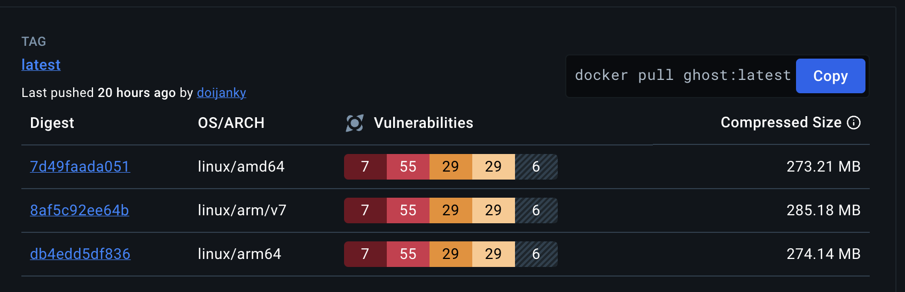
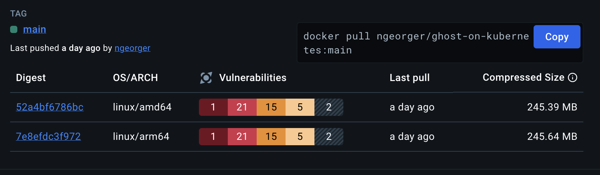

# Ghost on Kubernetes by SREDevOps.Org

<center><a href="https://sredevops.org" target="_blank" rel="noopener"></a></center>

**Community for SRE, DevOps, Cloud Native, GNU/Linux, and more. 🌎**

[](https://github.com/sredevopsorg/ghost-on-kubernetes/actions/workflows/multi-build.yaml) | [](https://github.com/sredevopsorg/ghost-on-kubernetes/pkgs/container/ghost-on-kubernetes) | [](https://securityscorecards.dev/viewer/?uri=github.com/sredevopsorg/ghost-on-kubernetes) | [](https://github.com/sredevopsorg/ghost-on-kubernetes/fork) | [](https://github.com/sredevopsorg/ghost-on-kubernetes/stargazers) | [](https://www.bestpractices.dev/projects/8888)

## Introduction

This repository implements Ghost CMS v5.xx.x from [@TryGhost (upstream)](https://github.com/TryGhost/Ghost) on Kubernetes, with our custom image, which has significant improvements to be used on Kubernetes [(Dockerfile)](https://github.com/sredevopsorg/ghost-on-kubernetes/blob/main/Dockerfile). See this whole README for more information.

## Star History

<picture>
  <source media="(prefers-color-scheme: dark)" srcset="https://api.star-history.com/svg?repos=sredevopsorg/ghost-on-kubernetes&type=Date&theme=dark" />
  <source media="(prefers-color-scheme: light)" srcset="https://api.star-history.com/svg?repos=sredevopsorg/ghost-on-kubernetes&type=Date" />
  
</picture>

## Recent Changes

We've made some significant updates to improve the security and efficiency of our Ghost implementation on Kubernetes:

1. **Multi-arch support**: The images are now multi-arch, with [support for amd64 and arm64](#arm64-compatible).
2. **Distroless Image**: We use [@GoogleContainerTools](https://github.com/GoogleContainerTools)'s [Distroless NodeJS](https://github.com/GoogleContainerTools/distroless/blob/main/examples/nodejs/Dockerfile) as the execution environment for the final image. Distroless images are minimal images that contain only the necessary components to run the application, making them more secure and efficient than traditional images.
3. **MySQL StatefulSet**: We've changed the MySQL implementation to a StatefulSet. This provides stable network identifiers and persistent storage, which is important for databases like MySQL that need to maintain state.
4. **Init Container**: We've added an init container to the Ghost deployment. This container is responsible for setting up the necessary configuration files and directories before the main Ghost container starts, ensuring the right directories are created, correct ownership for user node inside distroless container UID/GID to 65532, and the correct permissions are set.  Check [deploy/06-ghost-deployment.yaml](https://github.com/sredevopsorg/ghost-on-kubernetes/blob/main/deploy/06-ghost-deployment.yaml) for details on these changes.
5. **Entrypoint Script**: We've introduced a new entrypoint script that runs as the non-privileged user inside the distroless container. This script is responsible for updating the default themes then starts the Ghost application. This script is executed by the nonroot user without privileges within the Distroless container, which updates default themes and starts the Ghost application, operation performed into the distroless container in runtime. [entrypoint.js](https://github.com/sredevopsorg/ghost-on-kubernetes/blob/main/entrypoint.js)

## Features

- Both Ghost and MySQL components run as non-root user in Kubernetes, which significantly improves security, in addition to our custom image enhancements.
- Multi-arch support (amd64 and arm64).
- We use the official Node 20 Iron Bookworm image as our build environment. [Dockerfile](https://github.com/sredevopsorg/ghost-on-kubernetes/blob/main/Dockerfile).
- We introduce a multi-stage build, which reduces the final image size and improves security by removing unnecessary components from the final image.
- [Distroless Node 20 Debian 12](https://github.com/GoogleContainerTools/distroless/blob/main/README.md) as our runtime environment for the final image stage.
- Removed gosu, now everything runs as non-root (UID/GID 65532) inside the Distroless container. This change alone reduces 6 critical vulnerabilities and 34 high vulnerabilities reported by Docker Scout in the original Ghost image. References:

  - [Ghost Official Image](https://hub.docker.com/layers/library/ghost/latest/images/sha256-7d49faada051b5bee324e5bb60f537c1be559f9573a0db67b5090b61ac5e359d?context=explore)
    

  - [Ghost on Kubernetes Image on Docker Hub](https://hub.docker.com/layers/ngeorger/ghost-on-kubernetes/main/images/sha256-52a4bf6786bce9eb29e59174321ecbcbfd0b761991b56901205bfa9ffe49d848?context=explore)
    

- New Entrypoint flow, using a Node.js script executed by the unprivileged Node user inside the Distroless container, which updates the default themes and starts the Ghost application, an operation that is performed inside the Distroless container itself.
- We use the latest version of Ghost 5 (when the image is built).


## Installation

### 0. Clone the repository or fork it

```bash
# Clone the repository
git clone https://github.com/sredevopsorg/ghost-on-kubernetes.git --depth 1 --branch main --single-branch --no-tags
# Change directory
cd ghost-on-kubernetes
# Create a new branch for your changes (optional but recommended).
git checkout -b my-branch --no-track --detach


```

### 1. Check the example configurations

- There are some example configuration files in the [examples](https://github.com/sredevopsorg/ghost-on-kubernetes/blob/main/examples/) directory. We use the stored configuration as a `kind: Secret` in the `ghost-on-kubernetes` namespace for Ghost and MySQL configuration. There are two example configuration files:
  - `config.development.sample.yaml`: This configuration file is for the Ghost development environment. It uses SQLite as the database. It can be useful if you want to test the Ghost configuration before implementing it in a production environment.
  - `config.production.sample.yaml`: This configuration file is for the Ghost production environment. It uses MySQL 8, and is the recommended configuration for production environments. It requires a valid top-level domain (TLD) and [configuration for Ingress to access Ghost from the Internet](https://github.com/sredevopsorg/ghost-on-kubernetes/blob/main/deploy/07-ingress.yaml).
- If you need more information on the configuration, check the [official Ghost documentation](https://ghost.org/docs/config/#custom-configuration-files).

### 2. Review the default values and make changes as needed

### Understanding the Ghost Deployment Architecture on Kubernetes

Deploying a sophisticated application like Ghost on Kubernetes involves orchestrating several components. Let's break down the essential Kubernetes resources we'll use:

### Namespaces: Isolating Our Ghost Instance

Namespaces in Kubernetes provide a logical separation of resources. We'll use the `ghost-on-kubernetes` namespace to contain all resources related to our Ghost deployment. This approach enhances organization and prevents resource conflicts with other applications running on the same cluster.

```yaml
apiVersion: v1
kind: Namespace
metadata:
  name: ghost-on-kubernetes
  labels:
    app: ghost-on-kubernetes
    # ... other labels
```

### Secrets: Securely Storing Sensitive Information

Secrets in Kubernetes allow us to store and manage sensitive data, such as database credentials and TLS certificates, securely. We'll use the following Secrets:

- `ghost-config-prod`: Stores the Ghost configuration, including database connection details and mail server settings.
- `ghost-on-kubernetes-mysql-env`: Contains environment variables for the MySQL database, including the database name, username, and password.
- `tls-secret`: Holds the TLS certificate and key for enabling HTTPS on our Ghost blog.

```yaml
apiVersion: v1
kind: Secret
metadata:
  name: ghost-config-prod
  namespace: ghost-on-kubernetes
  # ... other metadata
type: Opaque
stringData:
  config.production.json: |-
    {
      # ... Ghost configuration
    }
```

### PersistentVolumeClaims: Persistent Storage for Our Blog

PersistentVolumeClaims (PVCs) in Kubernetes enable us to request persistent storage volumes. We'll use two PVCs:

- `k8s-ghost-content`: Provides persistent storage for Ghost's content, including images, themes, and uploaded files.
- `ghost-on-kubernetes-mysql-pvc`: Offers persistent storage for the MySQL database, ensuring data persistence across pod restarts and reschedulings.

```yaml
apiVersion: v1
kind: PersistentVolumeClaim
metadata:
  name: k8s-ghost-content
  namespace: ghost-on-kubernetes
  # ... other metadata
spec:
  # ... PVC specification
```

### Services: Exposing Ghost and MySQL Within the Cluster

Services in Kubernetes provide a way to expose our applications running on a set of pods as a network service. We'll define two services:

- `ghost-on-kubernetes-service`: Exposes the Ghost application internally within the cluster on port 2368.
- `ghost-on-kubernetes-mysql-service`: Exposes the MySQL database internally on port 3306, allowing the Ghost application to connect to the database.

```yaml
apiVersion: v1
kind: Service
metadata:
  name: ghost-on-kubernetes-service
  namespace: ghost-on-kubernetes
  # ... other metadata
spec:
  # ... Service specification
```

### StatefulSet: Managing the MySQL Database

A StatefulSet in Kubernetes is designed to manage stateful applications, such as databases, that require persistent storage and stable network identities. We'll use a StatefulSet to deploy a single replica of the MySQL database.

```yaml
apiVersion: apps/v1
kind: StatefulSet
metadata:
  name: ghost-on-kubernetes-mysql
  namespace: ghost-on-kubernetes
  # ... other metadata
spec:
  # ... StatefulSet specification
```

### Deployment: Managing the Ghost Application

Deployments in Kubernetes manage the deployment and scaling of stateless applications. We'll use a Deployment to deploy a single replica of the Ghost application.

```yaml
apiVersion: apps/v1
kind: Deployment
metadata:
  name: ghost-on-kubernetes
  namespace: ghost-on-kubernetes
  # ... other metadata
spec:
  # ... Deployment specification
```

### Ingress: Exposing Ghost to the Outside World

An Ingress resource in Kubernetes acts as a reverse proxy, routing external traffic to services within the cluster. We'll use an Ingress to expose our Ghost blog to the internet using a domain name.

```yaml
apiVersion: networking.k8s.io/v1
kind: Ingress
metadata:
  name: ghost-on-kubernetes-ingress
  namespace: ghost-on-kubernetes
  # ... other metadata
spec:
  # ... Ingress specification
```

## Bringing It All Together: Deploying Ghost on Kubernetes

With our Kubernetes resources defined, we can now deploy Ghost on our cluster. Follow these general steps:

1. **Create the Namespace:**

   ```bash
   kubectl apply -f deploy/00-namespace.yaml
   ```

2. **Create the Secrets:**

   ```bash
   kubectl apply -f deploy/01-mysql-config.yaml
   kubectl apply -f deploy/04-ghost-config.yaml
   kubectl apply -f deploy/01-tls.yaml
   ```

3. **Create the PersistentVolumeClaims:**

   ```bash
   kubectl apply -f deploy/02-pvc.yaml
   ```

4. **Create the Services:**

   ```bash
   kubectl apply -f deploy/03-service.yaml
   ```

5. **Deploy the MySQL Database:**

   ```bash
   kubectl apply -f deploy/05-mysql.yaml
   ```

6. **Deploy the Ghost Application:**

   ```bash
   kubectl apply -f deploy/06-ghost-deployment.yaml
   ```

7. **Expose Ghost with Ingress (Optional):**

   ```bash
   kubectl apply -f deploy/07-ingress.yaml
   ```

## Your Ghost Blog Is Live!

Congratulations! You've successfully deployed Ghost on a Kubernetes cluster. This setup provides a robust and scalable foundation for your blogging platform. Remember to customize the configurations, such as storage class, resource limits, and domain name, to suit your specific requirements.

## Contributing

We welcome contributions from the community! Please check the [CONTRIBUTING.md](https://github.com/sredevopsorg/ghost-on-kubernetes/blob/main/CONTRIBUTING.md) file for more information on how to contribute to this project.

## License and Credits

- This project is licensed under the GNU General Public License v3.0. Please check the [LICENSE](https://github.com/sredevopsorg/ghost-on-kubernetes/blob/main/LICENSE) file for more information.
- The Ghost CMS is licensed under the [MIT License](https://github.com/TryGhost/Ghost/blob/main/LICENSE).
- The node image and the Distroless image are licensed by their respective owners.
